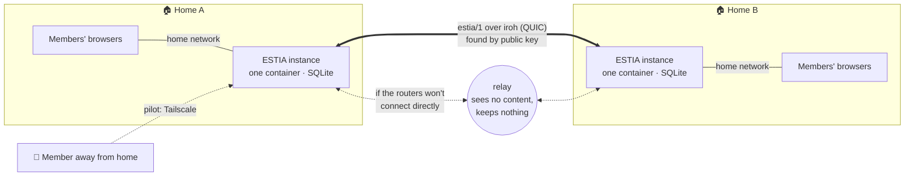
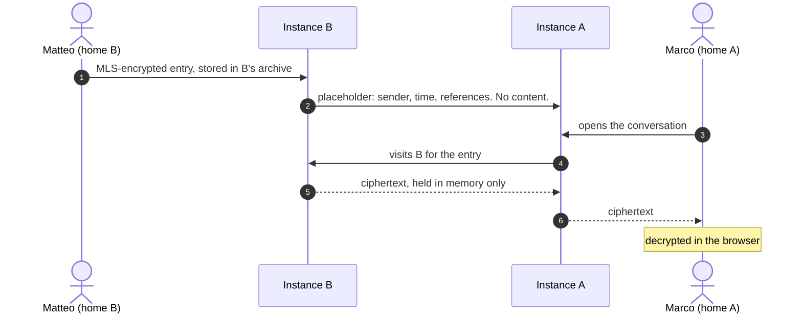

<div align="center">

# ESTIA

**A real social network whose content lives in a place that is yours.**

Your home, or your community's shared space: encrypted, with no algorithm and no ads.

[](https://github.com/chrono-web/estia/actions/workflows/verify.yml)
[](LICENSE)


[What it is](#what-it-is) · [Where it stands](#where-it-stands) · [Install](#install-an-instance) · [How it works](#how-it-works) · [Documentation](#documentation) · [Development](#development)

</div>

> 🇮🇹 L'interfaccia parla italiano e inglese; quasi tutta la documentazione è in italiano. La guida d'installazione passo per passo è [`docs/INSTALLAZIONE.md`](docs/INSTALLAZIONE.md); i termini del progetto, in italiano e in inglese, sono nel [glossario](docs/GLOSSARY.md).

## What it is

An ESTIA **instance** runs on a NAS or a small computer in a real place: a flat, a building, a street, a social space. On top of it sit three social surfaces with a single identity:

- the **local feed** of the people who share the instance;
- the **profile**, which reaches people on other ESTIA instances;
- **private messages**, end-to-end encrypted, which cross between instances.

Five words held together: **owned, shared, communal, protected, and connected to anyone.** Each on its own describes something that already exists; what is new is asking for all of them at once. The full vision is in [`docs/PRODUCT_VISION.md`](docs/PRODUCT_VISION.md), and its §11 says what that implies, including why this is also a political tool.

What that means in practice:

- 🏠 **Your content stays on your instance.** There is no central application server run by the developers.
- 🔑 **No domain, no certificate, no open ports.** First contact happens on the home network, and instances find each other by public key, even behind CGNAT.
- 👀 **Content is visited, not copied.** Someone reading you from another instance fetches your post from your machine. When you delete it, it is gone.
- 🔒 **Private messages are end-to-end, or they don't exist.** There is no plaintext fallback.
- 🧾 **The instance says what it cannot do.** Missing backups, an unencrypted disk, an update without a way back: the instance reports each of these in its diagnostics.

The infrastructure promise, worded precisely:

> No central application server run by the developers, and no community content kept outside the instance, unless an administrator explicitly chooses otherwise.

DNS, certificate authorities, push services and relays can still be third parties. [`docs/SECURITY_BASELINE.md`](docs/SECURITY_BASELINE.md) says what each of them sees.

## Where it stands

_Updated 2026-09-23. The only authoritative status is [`docs/IMPLEMENTATION_PLAN.md`](docs/IMPLEMENTATION_PLAN.md)._

✅ done and proven on real hardware · 🟡 built, not yet proven in the field · ⬜ not built

|     | Area                         | What exists                                                                                                                                                                                                                                                                                                             |
| --- | ---------------------------- | ----------------------------------------------------------------------------------------------------------------------------------------------------------------------------------------------------------------------------------------------------------------------------------------------------------------------- |
| ✅  | **Local feed**               | Posts, threaded comments, likes, up to four photos per post. Proven on a real NAS, with a non-technical member joining unassisted (M2).                                                                                                                                                                                 |
| ✅  | **Running an instance**      | One-command installer, the `estia` command, encrypted backups, restore, a backup before every migration, update checks, diagnostics. Installed in under 30 minutes by someone who had not written the guide, and restored from an encrypted backup on a NAS (M3).                                                       |
| ✅  | **Instances talking**        | Linking instances by public key, following across instances, profiles, posts and photos read in place, likes that cross. Proven across three homes (M5). Since then, a heartbeat notices when another instance comes back.                                                                                              |
| 🟡  | **Private messages**         | One-to-one, end-to-end. Since 2026-09-23 the web chat runs on **MLS** (RFC 9420): each author's words stay in their own instance's archive. Tested in a real browser on a fresh install, not yet between two homes in the field. The M6 field test is half done: the database and backup inspection is still to do.     |
| ⬜  | **Groups**                   | Conversations across three or more homes (M8).                                                                                                                                                                                                                                                                          |
| ⬜  | **More than one device**     | Decided in [ADR 0040](docs/adr/0040-un-membro-ha-piu-di-un-dispositivo.md), not built. For the chat, ESTIA is one device per person today.                                                                                                                                                                              |
| ⬜  | **Access from outside home** | The pilot uses Tailscale, documented in [`docs/ACCESSO_DA_FUORI.en.md`](docs/ACCESSO_DA_FUORI.en.md). The product's own transport is not decided yet (M4).                                                                                                                                                              |
| ⬜  | **Mobile apps**              | They don't exist. iOS and Android will be a program of their own after ESTIA 1.0; the preconditions are listed under M7 in the plan.                                                                                                                                                                                    |
| 🟡  | **Languages**                | Italian and English everywhere a person reads: interface, server messages, installer, `estia`, the install guide. Every sentence lives in a catalogue ([ADR 0044](docs/adr/0044-l-interfaccia-parla-piu-lingue.md)). Installed in both languages with the real installer; not yet by someone who doesn't speak Italian. |
| ⬜  | **Also not built**           | Push notifications, the optional ActivityPub bridge to the Fediverse, public app stores.                                                                                                                                                                                                                                |

**Know these before you rely on it:**

- **The chat needs HTTPS or `localhost`.** Browsers turn off their cryptography on plain `http://`, which is how an instance is reached on the home network. Over Tailscale the instance can get HTTPS on its `.ts.net` name ([`ACCESSO_DA_FUORI.md`](docs/ACCESSO_DA_FUORI.md) §8).
- **Messages from before 2026-09-23 no longer show** on an instance that was already in use. They were written with the earlier protocol, `ESTIA-E2E-v1`, and their migration isn't built yet ([ADR 0038](docs/adr/0038-mls-si-adotta-e-si-comincia-dal-web.md) point 4).
- **There is no safety number yet**, so nobody can check a contact's device keys out of band.
- **ESTIA does not encrypt the disk itself.** The host does that (LUKS, or the NAS's volume encryption), and the instance reports what it can verify ([ADR 0007](docs/adr/0007-cifratura-a-riposo-e-furto-fisico.md)).
- **Relays and discovery use the public servers of n0**, the makers of iroh. A relay only forwards encrypted packets and keeps nothing, but depending on n0 is a trade-off the project accepts openly ([ADR 0018](docs/adr/0018-federazione-fra-istanze-estia.md)).
- **Two languages today: Italian and English**, for the interface, the installer and the `estia` command. Each person picks theirs in **Settings → Language**; more languages can be added by translating one folder ([`docs/TRANSLATIONS.md`](docs/TRANSLATIONS.md)).

## Install an instance

You need a machine that stays on, such as a NAS, a mini-PC or an old laptop running Linux, with Docker:

```sh
curl -fsSL https://raw.githubusercontent.com/chrono-web/estia/main/install.sh | sh
```

The installer asks no questions. It prepares the place where the data will live, starts the instance, puts the `estia` command on the host, and prints the address to open from your phone. On a desktop Linux it may ask **once** for the administrator password, only to copy that command into `/usr/local/bin`. Don't run the script with `sudo`. Running the same command again updates the instance without touching what is in it.

Then open the printed address from another device on the same network and complete the setup: community name, description, and your administrator account. The one-time setup code is at the top of the container's output, which `estia logs` shows. It changes at every restart.

The complete guide covers NAS panels, Compose, backups, disk encryption, updates and what to do when something breaks: [`docs/INSTALLAZIONE.en.md`](docs/INSTALLAZIONE.en.md) (Italian original: [`docs/INSTALLAZIONE.md`](docs/INSTALLAZIONE.md)).

<details>
<summary><b>The <code>estia</code> command</b></summary>

| Command                        | What it does                                                |
| ------------------------------ | ----------------------------------------------------------- |
| `estia info` (default)         | Address, container state, where data and backups live       |
| `estia stato` · `status`       | Container state, mounts and security settings               |
| `estia logs`                   | The instance's output; `-f` to follow it                    |
| `estia backup`                 | Take an encrypted backup now                                |
| `estia chiavi` · `keys`        | Generate a backup key pair                                  |
| `estia ripristina` · `restore` | Restore from an encrypted backup                            |
| `estia riavvia` · `restart`    | Restart the container                                       |
| `estia aggiorna` · `update`    | Pull the latest image and recreate the container, data kept |
| `estia aiuto` · `help`         | Everything above, in English or Italian                     |

</details>

## How it works



**First contact happens on the home network** ([ADR 0003](docs/adr/0003-primo-contatto-in-rete-locale.md)). An instance installs and works with no domain, no certificate and no port forwarding. A new member joins from the home network with an invite, and from then on recognises the instance by its key. Being on the home network grants nothing by itself: authorisation always comes from a session.

**Instances find each other by public key** ([ADR 0018](docs/adr/0018-federazione-fra-istanze-estia.md), [0021](docs/adr/0021-la-forma-del-protocollo-fra-istanze.md)). They speak `estia/1` over [iroh](https://iroh.computer), directly when the two routers allow it and through a relay when they don't. On ordinary home lines the relay turned out to be the usual path, not the exception, and that is exactly what it is for. Linking two instances is a deliberate act on both sides, and an administrator can block an instance by its key ([ADR 0020](docs/adr/0020-che-cosa-puo-chiedere-un-istanza-che-non-conosciamo.md)).

**Content is visited, not copied** ([ADR 0023](docs/adr/0023-come-si-legge-la-bacheca-di-una-persona-di-un-altra-istanza.md), [0026](docs/adr/0026-i-commenti-remoti-restano-a-casa-di-chi-li-scrive.md)). A post stays on its author's machine and is served when someone asks for it. A comment stays on the commenter's instance, and the other side keeps only a pointer.

**Private messages work the same way** ([ADR 0042](docs/adr/0042-come-mls-attraversa.md), [0043](docs/adr/0043-custodia-lato-mittente.md)). Each person keeps custody of what they wrote:



Instance A never stores Matteo's words, not even encrypted. If B is switched off for good, Matteo's messages go with it. The ESTIA documents call this withdrawing one's own words.

**Backups can be opened without ESTIA** ([ADR 0013](docs/adr/0013-backup-cifrati-in-formato-age.md)). A backup is a `tar` archive encrypted with [age](https://age-encryption.org) to a public key. The private key leaves the NAS and never comes back, so the instance produces archives it cannot read itself. Whoever carries the NAS away gets unreadable backups.

**Photos are cleaned before they are stored** ([ADR 0011](docs/adr/0011-immagini-in-webassembly.md), [0012](docs/adr/0012-immagini-autenticate-non-indovinabili.md)). The browser resizes them. The instance checks them again anyway and removes Exif data, including the location a phone records. Images are served only to a signed-in session, never from a URL that works on its own.

## Documentation

The documents are in Italian, except where noted. The [glossary](docs/GLOSSARY.md) maps the project's words to English.

| Document                                                                                          | Answers                                                                        |
| ------------------------------------------------------------------------------------------------- | ------------------------------------------------------------------------------ |
| [`docs/INSTALLAZIONE.md`](docs/INSTALLAZIONE.md) · [_English_](docs/INSTALLAZIONE.en.md)          | How to install on a NAS, mini-PC or laptop, and what to do when it breaks      |
| [`docs/ACCESSO_DA_FUORI.md`](docs/ACCESSO_DA_FUORI.md) · [_English_](docs/ACCESSO_DA_FUORI.en.md) | How to reach the instance from outside home in the pilot, and what that costs  |
| [`docs/PRODUCT_VISION.md`](docs/PRODUCT_VISION.md)                                                | Why ESTIA exists, for whom, and how it should feel                             |
| [`docs/PROJECT_SPEC.md`](docs/PROJECT_SPEC.md)                                                    | What it must do, and which properties it must keep                             |
| [`docs/ARCHITECTURE.md`](docs/ARCHITECTURE.md)                                                    | How it is built, and what is still undecided                                   |
| [`docs/DESIGN_SYSTEM.md`](docs/DESIGN_SYSTEM.md)                                                  | How the interface is made, and the usability heuristics every change must pass |
| [`docs/IMPLEMENTATION_PLAN.md`](docs/IMPLEMENTATION_PLAN.md)                                      | What exists, in what order things get built, and when something is finished    |
| [`docs/SECURITY_BASELINE.md`](docs/SECURITY_BASELINE.md)                                          | What is protected, from whom, and what is left uncovered                       |
| [`docs/RECONCILIATION.md`](docs/RECONCILIATION.md)                                                | How this relates to the original project plan of July 2026                     |
| [`docs/GLOSSARY.md`](docs/GLOSSARY.md) · _English_                                                | The project's vocabulary, Italian and English                                  |
| [`docs/TRANSLATIONS.md`](docs/TRANSLATIONS.md) · _English_                                        | What exists in which language, and how to help translate                       |
| [`docs/spike/`](docs/spike/)                                                                      | Measurements taken before a decision                                           |
| [`AGENTS.md`](AGENTS.md) · [`CONTRIBUTING.md`](CONTRIBUTING.md)                                   | The rules for anyone writing code here, people and assistants alike            |

### Decisions

Every choice about identity, network, cryptography, portability or trust boundaries is recorded in an ADR in [`docs/adr/`](docs/adr/) **before** the code is written. By area:

**Network and federation.**
[0001](docs/adr/0001-private-network-control-plane.md) private-network control plane: closed, nothing adopted ·
[0003](docs/adr/0003-primo-contatto-in-rete-locale.md) first contact on the home network ·
[0017](docs/adr/0017-niente-mdns-nostro.md) local discovery is the NAS's job ·
[0018](docs/adr/0018-federazione-fra-istanze-estia.md) federation between ESTIA instances ·
[0020](docs/adr/0020-che-cosa-puo-chiedere-un-istanza-che-non-conosciamo.md) what an unknown instance may ask ·
[0021](docs/adr/0021-la-forma-del-protocollo-fra-istanze.md) the shape of the protocol ·
[0022](docs/adr/0022-il-follow-attraversa-le-istanze.md) follows that cross instances ·
[0023](docs/adr/0023-come-si-legge-la-bacheca-di-una-persona-di-un-altra-istanza.md) reading someone on another instance ·
[0025](docs/adr/0025-i-cuori-attraversano-e-le-notifiche-sono-una-lettura.md) likes that cross, notifications that are read ·
[0026](docs/adr/0026-i-commenti-remoti-restano-a-casa-di-chi-li-scrive.md) remote comments stay home ·
[0041](docs/adr/0041-le-istanze-si-tengono-d-occhio.md) the heartbeat

**Private messages and cryptography.**
[0006](docs/adr/0006-messaggi-privati-end-to-end-o-niente.md) end-to-end or nothing ·
[0028](docs/adr/0028-il-dispositivo-portatore-di-chiavi.md) the device holds the keys ·
[0030](docs/adr/0030-chi-puo-scrivere-a-chi.md) who may write to whom ·
[0032](docs/adr/0032-payload-messaggi-strutturato-e2e.md) message payload ·
[0033](docs/adr/0033-ri-derivazione-chiavi-messaggi-e2e.md) key self-repair ·
[0034](docs/adr/0034-distinzione-tra-dispositivo-fisico-e-sessione-di-login.md) device versus session ·
[0036](docs/adr/0036-estia-e2e-v1-e-il-debito-verso-mls.md) `ESTIA-E2E-v1` and the debt towards MLS ·
[0037](docs/adr/0037-la-cronologia-e-un-archivio-non-una-chiave.md) history is an archive ·
[0038](docs/adr/0038-mls-si-adotta-e-si-comincia-dal-web.md) MLS, starting from the web ·
[0039](docs/adr/0039-mls-attraversa-le-istanze.md) MLS crosses instances ·
[0040](docs/adr/0040-un-membro-ha-piu-di-un-dispositivo.md) more than one device ·
[0042](docs/adr/0042-come-mls-attraversa.md) how MLS crosses ·
[0043](docs/adr/0043-custodia-lato-mittente.md) sender-side custody.
Superseded or partly superseded: [0027](docs/adr/0027-la-libreria-mls.md), [0029](docs/adr/0029-un-messaggio-si-consegna.md), [0035](docs/adr/0035-crittografia-e2e-su-react-native.md) (a record of the withdrawn mobile client).

**Data and operations.**
[0005](docs/adr/0005-persistenza-node-sqlite.md) `node:sqlite` ·
[0007](docs/adr/0007-cifratura-a-riposo-e-furto-fisico.md) encryption at rest and theft ·
[0013](docs/adr/0013-backup-cifrati-in-formato-age.md) backups in age format ·
[0014](docs/adr/0014-backup-prima-delle-migrazioni.md) a backup before every migration ·
[0016](docs/adr/0016-backup-dal-pannello.md) backups from the panel, restore from the terminal ·
[0019](docs/adr/0019-i-dati-hanno-un-posto-prima-della-configurazione.md) no setup on data that will vanish ·
[0031](docs/adr/0031-cli-di-gestione-locale-estia.md) the `estia` command

**Accounts and media.**
[0008](docs/adr/0008-hashing-password-argon2id.md) Argon2id in WebAssembly ·
[0009](docs/adr/0009-recupero-accesso-amministratore.md) recovery with a transcribable code ·
[0011](docs/adr/0011-immagini-in-webassembly.md) image processing in WebAssembly ·
[0012](docs/adr/0012-immagini-autenticate-non-indovinabili.md) images served only with a session

**Client, scope and licence.**
[0002](docs/adr/0002-activitypub-confine-non-schema.md) ActivityPub is a boundary, not the schema ·
[0004](docs/adr/0004-client-web-e-trasporto-sostituibile.md) web client first, replaceable transport ·
[0010](docs/adr/0010-client-web-spa-statica.md) a static SPA served by the instance ·
[0015](docs/adr/0015-licenza-agpl.md) AGPL-3.0 ·
[0024](docs/adr/0024-preferenze-ui-personali.md) personal UI preferences from a closed catalogue

`ESTIA-piano-di-progetto.docx` (July 2026) is a historical document. It is still the source of the vision and of how the project is presented, but it has no authority over technical choices or their order. [`RECONCILIATION.md`](docs/RECONCILIATION.md) maps it item by item.

## Development

**Requirements:** Node.js `24.18.0` (pinned in [`.node-version`](.node-version), [`.nvmrc`](.nvmrc) and the Docker image; tools accept `>=22.22.0 <25`), pnpm `11.7.0` through Corepack, and Docker with Compose for the deployment smoke test.

From a clean clone:

```sh
corepack enable
corepack pnpm install --frozen-lockfile
cp .env.example .env
corepack pnpm verify     # format, lint, typecheck, test: the same command CI runs
```

`pnpm test` builds first, and endpoint tests use Fastify injection, so they open no real TCP ports. `pnpm format` checks the documentation too.

**Run the instance** without Docker:

```sh
pnpm build
set -a; . ./.env; set +a
node apps/core-api/dist/server.js
```

On first start the instance generates its key pair, stays `unconfigured` and prints a one-time **setup code** on the console. The code is a credential, so it never reaches the structured logs, and it changes at every restart. Open `http://127.0.0.1:3000` to complete the setup.

**Work on the web client** with live reload in two terminals. The dev server forwards API calls to the instance:

```sh
node apps/core-api/dist/server.js
pnpm --filter @estia/web dev
```

`pnpm build` compiles the client into `apps/core-api/public`, where the instance serves it: one process, one container.

**The API** is described by the OpenAPI document the instance generates from its route schemas, at `GET /openapi.json`. Authenticated routes take `Authorization: Bearer <token>`. `GET /health/live` and `GET /health/ready` are the health checks.

**Docker Compose smoke test:**

```sh
docker compose --env-file .env -f infra/compose/compose.yaml up --build --wait
curl --fail --silent http://127.0.0.1:3000/health/ready
docker compose --env-file .env -f infra/compose/compose.yaml down --remove-orphans
```

The container runs as UID/GID `10001` with a read-only filesystem, a temporary `/tmp` and every Linux capability dropped. Images are published for `linux/amd64` and `linux/arm64`.

> [!WARNING]
> The database and the instance's identity live in the `estia-data` volume. `down` keeps it. **`down --volumes` deletes the instance's identity**, and members who stored its key at first contact will no longer recognise it. Use it only on throwaway installs.

<details>
<summary><b>Configuration</b></summary>

No secret is passed through the environment: the instance generates its own identity and setup code. Every value is validated at start-up, and the process stops with an explicit error if one is invalid. [`.env.example`](.env.example) is a local starting point and holds no credentials.

| Variable                      | Default     | Meaning                                                                                         |
| ----------------------------- | ----------- | ----------------------------------------------------------------------------------------------- |
| `ESTIA_HOST`                  | `0.0.0.0`   | Listen address                                                                                  |
| `ESTIA_PORT`                  | `3000`      | Listen port, 1–65535                                                                            |
| `ESTIA_LOG_LEVEL`             | `info`      | `fatal`, `error`, `warn`, `info`, `debug`, `trace` or `silent`                                  |
| `ESTIA_DATA_DIR`              | `./.data`   | Database, instance identity and media; `/data` under Docker                                     |
| `ESTIA_MEDIA_MAX_BYTES`       | `5242880`   | 5 MiB, largest accepted image                                                                   |
| `ESTIA_MEDIA_MAX_PIXELS`      | `12000000`  | 12 Mpixel, a separate limit against decompression bombs                                         |
| `ESTIA_MEDIA_QUOTA_BYTES`     | `268435456` | 256 MiB per member, originals and thumbnails together                                           |
| `ESTIA_BACKUP_DIR`            | empty       | Where scheduled backups go; empty means **no scheduled backups**, and the logs say so           |
| `ESTIA_BACKUP_PUBLIC_KEY`     | empty       | The **public** `age1…` key; set together with the directory, never the private key              |
| `ESTIA_BACKUP_INTERVAL_HOURS` | `24`        | How often                                                                                       |
| `ESTIA_BACKUP_KEEP`           | `7`         | How many archives to keep                                                                       |
| `ESTIA_AT_REST_ENCRYPTION`    | empty       | What you declare about the volume: `passphrase`, `automatic` or `none`; empty is "not declared" |
| `ESTIA_NETWORK_PROBE`         | `off`       | `local` or `internet`; overrides the network switch in the admin panel                          |
| `ESTIA_ALLOW_EPHEMERAL_DATA`  | off         | Allow setup on data that won't survive an update. For a ten-minute look only                    |

Compose also reads `ESTIA_BIND_ADDRESS` and `ESTIA_HOST_PORT` (where the port is published on the host, `127.0.0.1:3000` by default), and `ESTIA_MEMORY_LIMIT` and `ESTIA_CPU_LIMIT`. A backup needs about six times the size of the data in memory, so size a memory limit against that.

</details>

<details>
<summary><b>Backups from the command line</b></summary>

Most administrators never need this: backups are managed from **Impostazioni → Amministrazione → Backup** in the web interface, where you generate the key pair, schedule backups and download archives. Restoring is done only from the terminal, on purpose: you need it exactly when the interface no longer opens.

```sh
node apps/core-api/dist/backup/cli.js chiavi                                  # generate a key pair
ESTIA_BACKUP_PUBLIC_KEY=age1... node apps/core-api/dist/backup/cli.js backup /path/to/backups
node apps/core-api/dist/backup/cli.js ripristina archive.tar.age /empty/dir   # asks for the private key
```

An archive opens without ESTIA too:

```sh
age -d -i private-key.txt estia-2026-08-15T09-30-00Z.tar.age | tar -xv
```

**Whoever loses the private key loses the archives**, with no way back. Backups don't stop the instance: the database snapshot is taken with `VACUUM INTO`.

</details>

<details>
<summary><b>Repository layout</b></summary>

```text
apps/core-api/            the instance: Fastify + node:sqlite, one process
  src/instance/           instance identity, first-run setup, data-location checks
  src/identity/           accounts, passwords, sessions, recovery, preferences
  src/admission/          invites and join requests
  src/feed/               posts, comments, likes, moderation, the network feed
  src/media/              images: validation, thumbnails in Wasm, quotas, storage
  src/profile/            profiles, presence, follows, search
  src/federation/         linked instances, the estia/1 protocol, the heartbeat
  src/network/            the network switch and reachability probe
  src/messaggi/           private messages: archives, placeholders, MLS handshake
  src/dispositivi/        devices and their signing keys
  src/notifiche/          notifications
  src/backup/ src/db/     backups, migrations, transactions
  src/update/             update checks
  src/admin/ src/web/     admin routes; serving the web client and its security policy
apps/web/                 React client served by the instance (ADR 0010); MLS client in src/mls/
packages/config/          configuration parsing and validation
packages/contracts/       API schemas and shared types
packages/testing/         helpers for tests on temporary resources
infra/compose/            the reference Docker Compose file
infra/network-lab/        material from the closed M0.2 network spike
bin/estia · install.sh    the host command and the one-line installer
docs/                     vision, spec, architecture, plan, ADRs, spikes
```

</details>

### How the project works

- **Decisions come before code.** Anything touching identity, network, cryptography, portability or trust boundaries gets an ADR first.
- **The plan says what really exists.** [`docs/IMPLEMENTATION_PLAN.md`](docs/IMPLEMENTATION_PLAN.md) uses three states: `[ ]` not started, `[~]` built but not yet proven on real hardware, `[x]` verified. Only `[x]` counts towards a milestone.
- **Every milestone ends in something runnable, tested and documented.** A milestone whose main path depends on mocks is not complete.

## Licence

ESTIA is free software under the **GNU Affero General Public License v3** ([`LICENSE`](LICENSE), [ADR 0015](docs/adr/0015-licenza-agpl.md)).

Anyone may host, modify and fork it. If you **modify it and offer it to others over a network**, you must offer those users the source of your version. That is clause §13, and it is why the plain GPL was not enough: a network service is never distributed, so the GPL would never apply to it. Hosting an unmodified instance carries no obligation. The licence covers the software, not the content: what members write and publish remains theirs.
