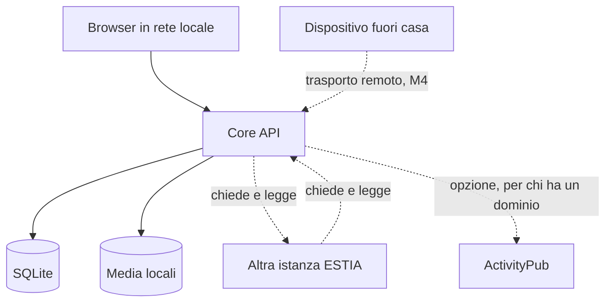

# Architettura iniziale di ESTIA

## 1. Strategia

ESTIA parte come monolite modulare distribuito in un solo container applicativo. Database, file e configurazioni restano su volumi dell'istanza. I componenti di rete — trasporto remoto, rete fra istanze, eventuali relay — sono separati e introdotti soltanto dalle milestone che li richiedono.



Il diagramma esprime dipendenze logiche, non container già autorizzati. Le due frecce fra istanze vanno in entrambe le direzioni e dicono la stessa cosa due volte: **si chiede e si legge**, non si consegna e si archivia (§7).

## 2. Struttura prevista della repository

```text
.
├── apps/
│   ├── core-api/          # Fastify, dominio e API dell'istanza
│   ├── web/               # client React, servito dall'istanza (ADR 0010)
│   └── mobile/            # React Native, aggiunto dopo lo spike di rete
├── packages/
│   ├── config/            # Parsing e validazione condivisa
│   ├── contracts/         # Schemi API e tipi condivisi
│   └── testing/           # Fixture e helper di test
├── infra/
│   ├── compose/           # Deployment di riferimento
│   └── network-lab/       # Esperimenti ripetibili su NAT e control plane
├── docs/
│   ├── adr/               # Architecture Decision Records
│   ├── PRODUCT_VISION.md
│   ├── PROJECT_SPEC.md
│   ├── ARCHITECTURE.md
│   ├── IMPLEMENTATION_PLAN.md
│   └── RECONCILIATION.md
├── AGENTS.md
└── README.md
```

`mobile` viene creata solo quando la milestone che la richiede diventa attiva. `network-lab` è materiale dello spike M0.2, ormai chiuso: va rimosso o riconvertito quando riprende il lavoro sul trasporto (M4).

## 3. Core API

Tecnologia prevista: Node.js Active LTS, TypeScript strict e Fastify.

Il core deve mantenere confini di modulo espliciti:

- `config`
- `health`
- `instance`
- `identity`
- `invites`
- `sessions`
- `feed`
- `comments`
- `media`
- `moderation`
- `admin`

Le chiamate tra moduli avvengono tramite servizi o porte interne, non importando direttamente tabelle o dettagli di persistenza di un altro modulo.

### I contenuti di un'altra istanza si visitano

Dal 2026-08-21 il feed della lente «rete» ha due sorgenti ([ADR 0023](adr/0023-come-si-legge-la-bacheca-di-una-persona-di-un-altra-istanza.md)): la tabella dei post di casa, autorizzata dalla lista `followers`, e le bacheche delle istanze che i membri seguono, prese da `following` al momento della lettura. **Niente di ciò che arriva viene scritto**: non c'è una tabella dei post remoti, e non è una funzione mancante — è la decisione 2 di [ADR 0018](adr/0018-federazione-fra-istanze-estia.md), ed è ciò che rende vera la promessa che una cancellazione cancella davvero.

Le due metà stanno in `feed/rete.ts` e si parlano con il protocollo attraverso due porte, come impone §3: `BoardDirectory` è ciò che il protocollo può chiedere alle bacheche di casa, `BachecaClient` è ciò che il feed chiede alla rete. Nessuna delle due lascia passare una tabella.

Il permesso non è un argomento di quelle funzioni: sta dentro la **prova della coppia**, un segreto coniato da chi è seguito quando accetta e conservato in chiaro solo da chi lo presenta. Ne discende che togliere un follower spegne la lettura alla richiesta successiva, senza spedire niente a nessuno.

Le fotografie viaggiano a parte, con il messaggio `immagine`: l'istanza di chi legge fa da **proxy sotto la sessione del membro** ([ADR 0012](adr/0012-immagini-autenticate-non-indovinabili.md)), senza scrivere i byte su disco. Un originale più grande del `media.maxBytes` di chi legge non si scarica.

### Un cuore attraversa, una risposta no

Dal 2026-08-21 il protocollo ha un settimo messaggio, `cuore` ([ADR 0025](adr/0025-i-cuori-attraversano-e-le-notifiche-sono-una-lettura.md)). **Non è una notifica spinta**, che [ADR 0021](adr/0021-la-forma-del-protocollo-fra-istanze.md) §3 rimanda a una decisione sua: è una richiesta che parte da chi ha appena premuto un pulsante, una domanda e una risposta su uno stream come tutto il resto.

Il permesso è la **stessa prova della bacheca**, prova sentinella dei profili pubblici compresa: chi può leggere un post può mettergli un cuore, e non esiste un secondo permesso per la stessa relazione. Su un profilo pubblico l'identità di chi lo mette è però garantita **fino alla casa e non fino alla persona** — il nome è dichiarato dall'istanza (ADR 0020 §5) — ed è un confine da riesaminare prima che i profili pubblici siano leggibili da istanze non collegate.

`remote_post_likes` è la prima tabella che conserva un fatto prodotto altrove, e la giustificazione è la stessa asimmetria di [ADR 0022](adr/0022-il-follow-attraversa-le-istanze.md): un cuore sul proprio post è un fatto sul **proprio** contenuto, e la lista che conta sta con chi la deve contare. Chi il cuore lo mette non conserva invece niente: `cuori` e `mioCuore` tornano dalla bacheca, calcolati contro la prova con cui si sta chiedendo. Le **risposte** non attraversano, e non per simmetria mancata: un cuore è un fatto di una riga e si revoca cancellandola, mentre una risposta sono parole ospitate qui e scritte da chi non è membro di questa istanza — cioè moderazione federata, che è una voce sua.

### Le notifiche sono una lettura

Non esiste una tabella di notifiche ([ADR 0025](adr/0025-i-cuori-attraversano-e-le-notifiche-sono-una-lettura.md) §4), e la sua assenza è la decisione. `notifiche/repository.ts` interroga con un `UNION ALL` le sei sorgenti che i fatti li contengono già — `post_likes`, `remote_post_likes`, `comment_likes`, `comments` per le due forme di risposta, e `followers` per le due facce di un follow — mentre `notifiche/service.ts` raggruppa i cuori sullo stesso oggetto e impagina.

Ne discendono tre proprietà che una tabella di eventi avrebbe dovuto inseguire con del lavoro: un post cancellato porta via le proprie notifiche, un cuore tolto toglie la propria, e non c'è **niente da ripulire mai** — che su un NAS di casa non è un dettaglio. Si scrive una cosa sola, `notifiche_viste`, cioè fin dove una persona ha già guardato: l'unica non deducibile da nient'altro.

### Thread dei commenti

Un commento è un’unità completa (autore, testo, like, moderazione), non una riga sotto il post. `parentId` punta al **commento immediato** a cui si risponde; l’albero è ricorsivo. È la stessa forma che ActivityPub esprimerà con `inReplyTo` (§9): non un secondo modello, e non un livello unico schiacciato sulla radice. Nel client web la rail sull’avatar e le linee verticali sono solo presentazione: nel feed un solo commento resta inline, due o più diventano «Mostra N risposte» verso `/p/:id`.

### I messaggi privati si consegnano

I messaggi privati introducono una **deroga esplicita ad ADR 0018** ([ADR 0029](adr/0029-un-messaggio-si-consegna.md)): i messaggi non si visitano, **si consegnano**. Per permettere la lettura asincrona anche a mittente offline, la busta crittografica opaca (BLOB cifrato E2E con `ESTIA-E2E-v1`: ECDH P-256 + AES-GCM-256, [ADR 0036](adr/0036-estia-e2e-v1-e-il-debito-verso-mls.md) — **non** MLS) viene recapitata alla casella postale (istanza) del destinatario e conservata nel suo database.

**Questo è come è costruito oggi, ed è esattamente ciò che [ADR 0043](adr/0043-custodia-lato-mittente.md) ribalta** — Proposed dal 2026-08-28. Se accettata, la busta smette di essere conservata da chi riceve — si cancella appena il suo dispositivo l'ha presa — e la cronologia diventa l'unione delle custodie: ogni casa conserva le voci d'archivio dei messaggi scritti dai **suoi** membri, e il client le **visita**, come già fa con i post ([ADR 0018](adr/0018-federazione-fra-istanze-estia.md) decisione 2). Cadono con essa [ADR 0037](adr/0037-la-cronologia-e-un-archivio-non-una-chiave.md) e il punto 4 di [ADR 0042](adr/0042-come-mls-attraversa.md). Finché non è decisa vale quello che è scritto qui, che è quello che il codice fa.

Nessun testo in chiaro tocca il database o i log: l'istanza agisce da postino cieco che trasporta e conserva buste chiuse. Le chiavi private vivono esclusivamente sui dispositivi dei membri in IndexedDB ([ADR 0028](adr/0028-il-dispositivo-portatore-di-chiavi.md)).

Il protocollo federato include:

- `chiavi`: richiesta e consumo monouso di `KeyPackage` per inizializzare il canale cifrato;
- `messaggio`: consegna della busta chiusa protetta dalla **prova di coppia** ([ADR 0030](adr/0030-chi-puo-scrivere-a-chi.md)), con tetto di 64 kB per busta e budget dedicato in `limits.ts` per evitare DoS dello storage.

La spedizione remota è resa resiliente da `messaggi_in_uscita` (migrazione 22) e da un background worker (`OutboxDrainer`) con exponential backoff per gestire istanze temporaneamente irraggiungibili o spente.

L'API usa schemi runtime e produce OpenAPI dalla stessa fonte quando possibile. Gli errori hanno un formato stabile con codice macchina, messaggio sicuro e correlation ID.

## 4. Persistenza

SQLite è il default per le istanze piccole. La scelta di driver e query builder deve essere validata su container `linux/amd64` e `linux/arm64`, perché moduli Node nativi possono complicare la distribuzione su NAS.

Principi:

- migrazioni forward versionate;
- transazioni nei confini di caso d'uso;
- foreign key attive;
- indici derivati da query reali;
- date in UTC;
- ID interni non ricavati da username o dominio;
- soft delete dove la federazione futura richiederà tombstone;
- repository di persistenza sostituibili nei test senza duplicare la logica di dominio.

PostgreSQL non deve condizionare il primo schema. Verrà aggiunto solo se esiste un requisito reale per istanze più grandi.

## 5. Storage media

Il core usa una porta `MediaStorage` e un adapter filesystem iniziale. Database e storage devono mantenere consistenza mediante stato esplicito dell'upload e cleanup dei file orfani.

La pipeline, come è stata realizzata in M2.3. L'ordine non è di comodo: ogni passo protegge quello dopo, e il tipo e la misura vanno stabiliti prima che qualcosa allochi memoria.

1. riconosce il tipo **dai byte**, non dall'estensione né dall'intestazione dichiarata;
2. legge le dimensioni dall'intestazione, **senza decodificare**, e rifiuta oltre soglia in byte e in pixel;
3. applica la quota del membro prima di scrivere;
4. decodifica e produce la miniatura, che è anche la prova che il file è un'immagine;
5. toglie dal file i metadati che non servono a disegnarlo, Exif compreso;
6. genera un identificatore server-side, da cui — e solo da cui — deriva il percorso;
7. scrive in un file temporaneo e lo rinomina, così nessuno legge un'immagine a metà;
8. registra misure e pesi nel database, che è ciò che la quota legge;
9. elimina i temporanei, e i file già scritti, se qualcosa fallisce.

Lo stato esplicito dell'upload è il legame con il post: un'immagine caricata resta **orfana** finché un post non la reclama, e una spazzata periodica raccoglie quelle che nessuno ha usato. Il post e le sue immagini si scrivono in una sola transazione.

`ffmpeg`, code distribuite e storage S3 non fanno parte del primo percorso.

## 6. Deployment

Il deployment di riferimento usa Docker Compose con:

- immagine non-root;
- filesystem applicativo read-only dove possibile;
- volumi nominati o bind mount espliciti per database, media e configurazione;
- health check;
- limiti e restart policy documentati;
- backup eseguibile senza entrare manualmente nel container;
- configurazione di sviluppo distinta dalla configurazione di produzione.

Caddy entra quando serve TLS pubblico. Non deve essere inserito nel bootstrap soltanto come placeholder.

## 7. Rete: come si raggiunge un'istanza, e come le istanze si parlano

Sono tre percorsi distinti, con tre stati diversi. Il piano iniziale ne prevedeva uno solo — WireGuard e Headscale integrati nell'app — e quella strada è chiusa senza essere stata adottata ([ADR 0001](adr/0001-private-network-control-plane.md)): il control plane su un NAS dietro CGNAT non può coordinare il primo collegamento senza un percorso pubblico preesistente, e ottenerlo costava sette passaggi tecnici all'amministratore.

| Percorso             | A che serve                                 | Stato                                                                                       |
| -------------------- | ------------------------------------------- | ------------------------------------------------------------------------------------------- |
| **Rete locale**      | Primo contatto e uso quotidiano             | Costruito, è il percorso principale ([ADR 0003](adr/0003-primo-contatto-in-rete-locale.md)) |
| **Trasporto remoto** | Un dispositivo raggiunge la propria istanza | M4: dichiarato nell'interfaccia, documentato per il pilot, trasporto non ancora scelto      |
| **Rete fra istanze** | Due istanze si parlano                      | Deciso e non implementato ([ADR 0018](adr/0018-federazione-fra-istanze-estia.md))           |

I tre non vanno confusi: il secondo è un problema di dispositivi — client iOS e Android, app store, uno strato di rete sul telefono — mentre il terzo è un problema fra due server Linux, e i blocchi dell'uno non valgono per l'altro.

Per il terzo percorso valgono due proprietà architetturali, decise in ADR 0018:

- **si indirizza per chiave pubblica**, non per nome o indirizzo: nessun dominio, nessun certificato, nessuna porta aperta;
- **i contenuti si visitano, non si replicano**: un post resta sull'istanza di chi lo ha scritto e viene servito su richiesta. Il percorso è client → propria istanza → istanza di origine, e il passaggio intermedio **tiene i contenuti in memoria senza scriverli su disco**. È un vincolo, non un'ottimizzazione: da esso dipendono la cancellazione e la revoca reali.

La UI del prodotto non dipende da nessuno dei tre: usa una porta applicativa con stati espliciti, come da §8.

## 8. Client mobile

React Native resta la scelta prevista. **Il primo taglio (M7, 2026-08-23) non contiene un motore di rete**: parla HTTP in LAN, come il web. Iroh sul telefono e ogni alternativa di trasporto aspettano l'ADR di M4; finché manca, l'app non li finge.

Expo Go non è un ambiente di lavoro. Servono una build nativa e un dev client: Keychain già nel primo taglio, binding di trasporto solo dopo l'ADR.

Quando il trasporto nativo arriverà, non è una VPN che mette il telefono su una rete virtuale ([ADR 0001](adr/0001-private-network-control-plane.md) è chiuso senza adozione). È un'app che parla con un servizio. Fino a quella decisione, questi pezzi restano il rischio non misurato, non il codice da scrivere:

- iOS: Network Extension con packet tunnel provider, solo se l'ADR di M4 scegliesse una VPN — oggi non la sceglie;
- Android: `VpnService` o API di profilo, stessa riserva;
- ciclo di vita, background, cambio Wi-Fi/rete mobile: da misurare sullo spike del trasporto, non sul primo sideload.

La UI del prodotto non deve dipendere direttamente dall'SDK di rete: usa una porta applicativa con stati come `unconfigured`, `connecting`, `connected`, `degraded`, `revoked` ed `error`. Nel primo taglio `connected` significa HTTP in LAN.

## 9. ActivityPub come adapter

Il core sociale usa un modello interno. La decisione, gli invarianti di dominio che la rendono sostenibile e il modo in cui vengono verificati sono in [ADR 0002](adr/0002-activitypub-confine-non-schema.md); sostituisce la scelta opposta del piano di progetto di luglio 2026.

Un adapter ActivityPub futuro tradurrà:

- profilo interno → actor;
- post → `Note`, `Image` o altro tipo compatibile;
- commento → oggetto con `inReplyTo`;
- scope → addressing `to`/`cc`;
- cancellazione → `Delete`/tombstone;
- migrazione → `Move`.

Inbox e outbox non devono condividere direttamente i repository del feed senza un livello di validazione, autorizzazione, idempotenza e deduplicazione.

L'adapter è **la superficie fatta di copie**, e in questo si distingue dalla rete fra istanze del §7: ciò che esce di qui viene archiviato su server altrui e non torna indietro. Per questo è una scelta esplicita di chi pubblica, e non il comportamento predefinito ([ADR 0018](adr/0018-federazione-fra-istanze-estia.md)).

## 10. Osservabilità e privacy

Il sistema produce log strutturati locali con livelli configurabili. Non registra:

- password;
- token di sessione o invito completi;
- chiavi private;
- corpi di post o messaggi;
- file caricati;
- header di autorizzazione.

Metriche e telemetria remote sono opt-in e non fanno parte del bootstrap. Gli endpoint diagnostici devono distinguere informazioni sicure per l'utente da dettagli riservati all'amministratore.

## 11. Fonti tecniche per i percorsi di rete

**Rete fra istanze** (§7, [ADR 0018](adr/0018-federazione-fra-istanze-estia.md)):

- iroh, che cos'è: https://docs.iroh.computer/what-is-iroh
- Binding ufficiali: https://docs.iroh.computer/languages
- Relay: https://docs.iroh.computer/concepts/relays
- Scoperta: https://docs.iroh.computer/concepts/discovery

**Trasporto remoto e client mobile** (§7 e §8):

- Apple Packet Tunnel Provider: https://developer.apple.com/documentation/networkextension/packet-tunnel-provider
- Android VPN: https://developer.android.com/develop/connectivity/vpn

Le fonti dello spike chiuso su Headscale e DERP restano in [ADR 0001](adr/0001-private-network-control-plane.md), dove sono l'evidenza di una decisione, non un riferimento corrente.
