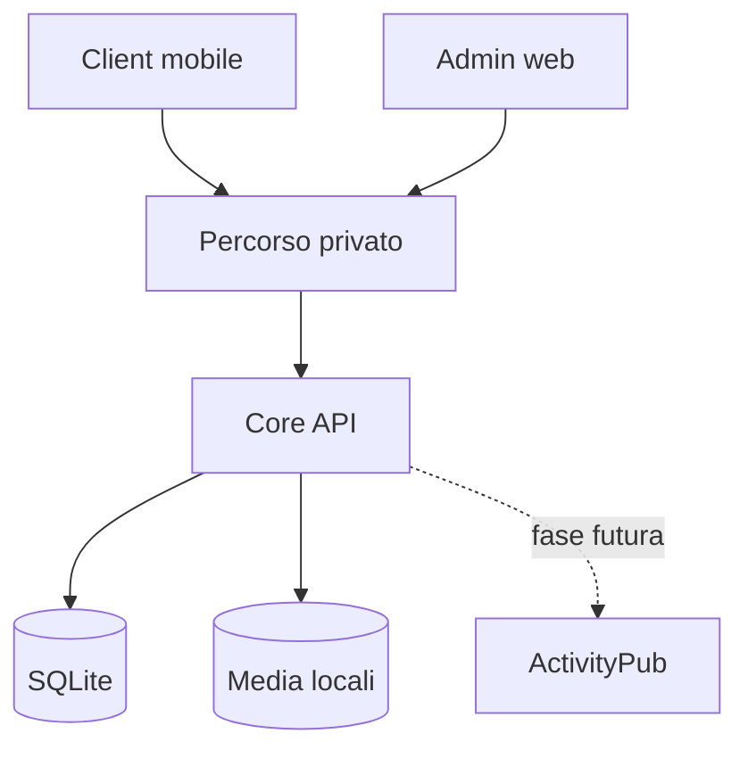

# Architettura iniziale di ESTIA

## 1. Strategia

ESTIA parte come monolite modulare distribuito in un solo container applicativo. Database, file e configurazioni restano su volumi dell'istanza. Caddy, il componente di rete privata e gli eventuali relay sono componenti infrastrutturali separati, introdotti soltanto dalle milestone che li richiedono.



Il diagramma esprime dipendenze logiche, non container già autorizzati per la prima milestone.

## 2. Struttura prevista della repository

```text
.
├── apps/
│   ├── core-api/          # Fastify, dominio e API dell'istanza
│   ├── web/               # client React, servito dall'istanza (ADR 0010)
│   └── mobile/            # React Native, aggiunto dopo lo spike di rete
├── packages/
│   ├── config/            # Parsing e validazione condivisa
│   ├── contracts/         # Schemi API e tipi condivisi
│   └── testing/           # Fixture e helper di test
├── infra/
│   ├── compose/           # Deployment di riferimento
│   └── network-lab/       # Esperimenti ripetibili su NAT e control plane
├── docs/
│   ├── adr/               # Architecture Decision Records
│   ├── PRODUCT_VISION.md
│   ├── PROJECT_SPEC.md
│   ├── ARCHITECTURE.md
│   ├── IMPLEMENTATION_PLAN.md
│   └── RECONCILIATION.md
├── AGENTS.md
└── README.md
```

`mobile` viene creata solo quando la milestone che la richiede diventa attiva. `network-lab` è materiale dello spike M0.2, ormai chiuso: va rimosso o riconvertito quando inizia M4.

## 3. Core API

Tecnologia prevista: Node.js Active LTS, TypeScript strict e Fastify.

Il core deve mantenere confini di modulo espliciti:

- `config`
- `health`
- `instance`
- `identity`
- `invites`
- `sessions`
- `feed`
- `comments`
- `media`
- `moderation`
- `admin`

Le chiamate tra moduli avvengono tramite servizi o porte interne, non importando direttamente tabelle o dettagli di persistenza di un altro modulo.

L'API usa schemi runtime e produce OpenAPI dalla stessa fonte quando possibile. Gli errori hanno un formato stabile con codice macchina, messaggio sicuro e correlation ID.

## 4. Persistenza

SQLite è il default per le istanze piccole. La scelta di driver e query builder deve essere validata su container `linux/amd64` e `linux/arm64`, perché moduli Node nativi possono complicare la distribuzione su NAS.

Principi:

- migrazioni forward versionate;
- transazioni nei confini di caso d'uso;
- foreign key attive;
- indici derivati da query reali;
- date in UTC;
- ID interni non ricavati da username o dominio;
- soft delete dove la federazione futura richiederà tombstone;
- repository di persistenza sostituibili nei test senza duplicare la logica di dominio.

PostgreSQL non deve condizionare il primo schema. Verrà aggiunto solo se esiste un requisito reale per istanze più grandi.

## 5. Storage media

Il core usa una porta `MediaStorage` e un adapter filesystem iniziale. Database e storage devono mantenere consistenza mediante stato esplicito dell'upload e cleanup dei file orfani.

La pipeline iniziale:

1. valida quota, dimensione e tipo;
2. genera un identificatore server-side;
3. scrive in area temporanea;
4. verifica e trasforma l'immagine;
5. sposta atomicamente nel percorso definitivo;
6. registra metadati e varianti;
7. elimina i temporanei in caso di fallimento.

`ffmpeg`, code distribuite e storage S3 non fanno parte del primo percorso.

## 6. Deployment

Il deployment di riferimento usa Docker Compose con:

- immagine non-root;
- filesystem applicativo read-only dove possibile;
- volumi nominati o bind mount espliciti per database, media e configurazione;
- health check;
- limiti e restart policy documentati;
- backup eseguibile senza entrare manualmente nel container;
- configurazione di sviluppo distinta dalla configurazione di produzione.

Caddy entra quando serve TLS pubblico. Non deve essere inserito nel bootstrap soltanto come placeholder.

## 7. Rete privata: nodo bloccante

Il piano iniziale va corretto su tre punti:

1. Headscale implementa il control server di Tailscale; non orchestra client WireGuard generici.
2. I client devono raggiungere Headscale via HTTPS. Un Headscale collocato esclusivamente sul NAS dietro CGNAT non può coordinare il primo collegamento senza un percorso pubblico preesistente.
3. DERP risolve il relay dei pacchetti quando il collegamento diretto fallisce, ma richiede a sua volta infrastruttura pubblicamente raggiungibile.

Perciò la topologia definitiva non è ancora decisa. `ADR 0001` definisce le opzioni e gli esperimenti necessari.

Il primo spike deve separare:

- **control plane** — registrazione dei nodi, policy, distribuzione delle informazioni di rete;
- **data plane** — traffico cifrato tra telefono e NAS;
- **relay** — inoltro cifrato quando il collegamento diretto non è possibile;
- **bootstrap** — primo contatto del dispositivo invitato.

## 8. Client mobile

React Native resta la scelta prevista, ma l'integrazione VPN richiede componenti nativi:

- iOS: Network Extension con packet tunnel provider;
- Android: `VpnService` o API di profilo supportate dal sistema;
- motore WireGuard/Tailscale e gestione del ciclo di vita fuori dal solo runtime JavaScript.

Expo Go non è un criterio di compatibilità sufficiente. Lo spike deve verificare build, firma, permessi, riconnessione, split tunnel, cambio Wi-Fi/rete mobile e comportamento in background.

La UI del prodotto non deve dipendere direttamente dall'SDK di rete: usa una porta applicativa con stati come `unconfigured`, `connecting`, `connected`, `degraded`, `revoked` ed `error`.

## 9. ActivityPub come adapter

Il core sociale usa un modello interno. La decisione, gli invarianti di dominio che la rendono sostenibile e il modo in cui vengono verificati sono in [ADR 0002](adr/0002-activitypub-confine-non-schema.md); sostituisce la scelta opposta del piano di progetto di luglio 2026.

Un adapter ActivityPub futuro tradurrà:

- profilo interno → actor;
- post → `Note`, `Image` o altro tipo compatibile;
- commento → oggetto con `inReplyTo`;
- scope → addressing `to`/`cc`;
- cancellazione → `Delete`/tombstone;
- migrazione → `Move`.

Inbox e outbox non devono condividere direttamente i repository del feed senza un livello di validazione, autorizzazione, idempotenza e deduplicazione.

## 10. Osservabilità e privacy

Il sistema produce log strutturati locali con livelli configurabili. Non registra:

- password;
- token di sessione o invito completi;
- chiavi private;
- corpi di post o messaggi;
- file caricati;
- header di autorizzazione.

Metriche e telemetria remote sono opt-in e non fanno parte del bootstrap. Gli endpoint diagnostici devono distinguere informazioni sicure per l'utente da dettagli riservati all'amministratore.

## 11. Fonti tecniche per il nodo rete

- Headscale: https://headscale.net/
- Requisiti di raggiungibilità Headscale: https://headscale.net/stable/usage/getting-started/
- DERP in Headscale: https://headscale.net/stable/ref/derp/
- Apple Packet Tunnel Provider: https://developer.apple.com/documentation/networkextension/packet-tunnel-provider
- Android VPN: https://developer.android.com/develop/connectivity/vpn
